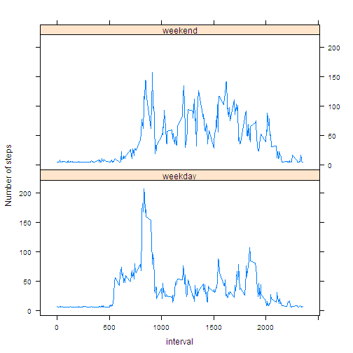

---
output:
  pdf_document: default
  html_document:
    fig_caption: yes
---
Reproducible Research: Peer Assessment 1
====================================================================


```r
library(lattice)
```


#####Loading and preprocessing the data

```r
thefile<- "C:/Documents and Settings/tbelay/Desktop/coursera/ReproducibleResearch/Project1/RepData_PeerAssessment1/Activity.zip"
data<- read.csv(unzip(thefile, "activity.csv"))
```
######Removing the missing values

```r
data1<-na.omit(data)
```
### What is mean total number of steps taken per day?

```r
total_steps_perday<-tapply(data1$steps,data1$date,sum)
total_steps_perday<-as.data.frame(total_steps_perday); colnames(total_steps_perday)<-c("steps")

hist(total_steps_perday$steps, col="darkgreen", main="Total steps per day", xlab="")
```

 

```r
mean(total_steps_perday$steps, na.rm=T)
```

```
## [1] 10766
```

```r
median(total_steps_perday$steps, na.rm=T)
```

```
## [1] 10765
```

### What is the average daily activity pattern?


```r
plot(tapply(data1$steps, data1$interval, mean), ylab="Average steps", type="l", xaxt = 'n')
axis(1, labels = c('0:00', '5:00', '10:00', '15:00', '20:00'), at = c(0, 50, 100, 150, 200))
```

 

######The interval which contains the maximum average steps across all the days is: 


```r
data1$date[max(tapply(data1$steps, data1$interval, mean))]
```

```
## [1] 2012-10-02
## 61 Levels: 2012-10-01 2012-10-02 2012-10-03 2012-10-04 ... 2012-11-30
```

### Imputing missing values

###### number of missing values in the dataset (i.e. the total number of rows with NAs)


```r
sum(is.na(data))
```

```
## [1] 2304
```

##### my strategies for filling the missing values are: 
        1. to use global average if the number of missing values per day is more than half of the available data for the day
        2. to use the average for the day if the number of missing values is less than half

```r
perday<-split(data,data$date)
newdata<-data.frame()
for(i in 1:length(perday)){    
        datatemp<-perday[[i]]        
        {if (sum(is.na(datatemp$steps))>nrow(datatemp)/2){
                missing<-is.na(datatemp$steps)
                datatemp$steps[missing]<- mean(as.numeric(data$steps), na.rm=TRUE)
        }else {
                missing<- is.na(datatemp$steps)
                datatemp$steps[missing]<- mean(as.numeric(datatemp$steps), na.rm=TRUE)
                }}
        
        newdata<- rbind(newdata,datatemp)
}

hist(tapply(newdata$steps,newdata$date,sum), col="darkblue", main="Total steps per day after filling the missing values", xlab="")
```

 

##### The 'newdata' at the end of the above 'for' loop contains the original dataset with the missing values filled

```r
sum(is.na(newdata))
```

```
## [1] 0
```
###### The mean and median of the total number of steps taken per day

```r
        mean(tapply(newdata$steps,newdata$interval,sum))
```

```
## [1] 2280
```

```r
        median(tapply(newdata$steps,newdata$interval,sum))
```

```
## [1] 2107
```
### Are there differences in activity patterns between weekdays and weekends?
###### creating a new variable

```r
newdata$dtfactor<-""

newdata[(weekdays(as.Date(newdata$date)) %in% c("Monday", "Tuesday", "Wednesday", "Thursday", "Friday")),]$dtfactor<-"weekday"
newdata[(weekdays(as.Date(newdata$date)) %in% c("Saturday","Sunday" )),]$dtfactor<-"weekend"
agg_newdata<- aggregate(newdata$steps, by=list(newdata$interval, newdata$dtfactor), mean)
colnames(agg_newdata)<-c("interval","datefactor", "meansteps")
```
##### make a pannel plot containing a time series plot

```r
xyplot(meansteps~interval|datefactor, data=agg_newdata, layout=c(1,2), type="l", ylab="Number of steps")
```

 
